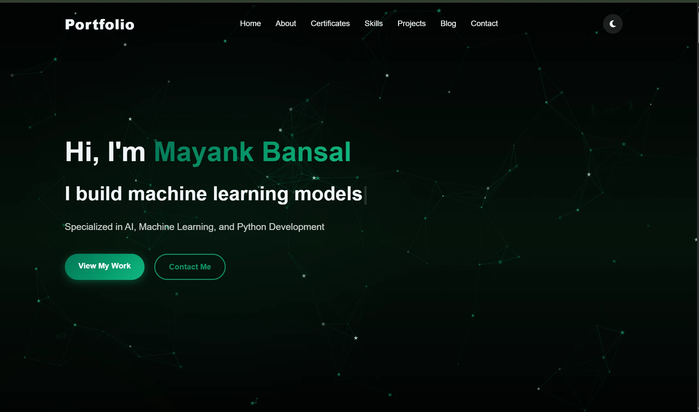

# Mayank Bansal | AI & Machine Learning Portfolio

[](https://mayank149.github.io/Portfolio/)
[](https://github.com/Mayank149)
[](https://www.linkedin.com/in/mayank-bansal14)

A modern, high-performance developer portfolio built with an emerald-accented obsidian theme, interactive physics particles, and dynamic project filtering. Showcasing production-ready Autonomous AI Agents, Retrieval-Augmented Generation (RAG) pipelines, computer vision applications, and published technical books.

---

##  Demo Preview



---

##  About Me

I am a 3rd-year B.Tech Computer Science & Engineering student (**CGPA: 9.41**) specializing in **Artificial Intelligence, Machine Learning, and Full-Stack Python Development**. I architect and deploy intelligent systems, ranging from state-machine driven agentic workflows and semantic vector search engines to deep computer vision models.

I am also the published author of [**Machine Learning Projects: A Practical Guide for B.Tech CSE Students**](https://www.amazon.in/dp/B0GX34T5HF) on Amazon Kindle.

---

##  Key Featured Projects

### 1. [AI Career Copilot](https://github.com/Mayank149/AI-Career-Copilot-Complete-)
- **Tech Stack:** Python, FastAPI, LangChain, LangGraph, RAG, ChromaDB, Groq, Ollama, Docker
- Architected an agentic RAG career assistant and ATS scorer with LangGraph state machine orchestration and human-in-the-loop resume diff reviews.
- Engineered a dual-provider LLM pipeline (Groq cloud & Ollama local) with ChromaDB semantic retrieval (90% Recall@4, 0.83 MRR@4, 0.81s P50 latency).
- Containerized the microservices stack with Docker and exposed modular endpoints via FastAPI.

### 2. [Technical Debug Assistant](https://github.com/Mayank149/Technical-Debug-Assistant)
- **Tech Stack:** Multi-Hop RAG, Python, FAISS, Groq API, Llama 3.3 70B, Semantic Search, Prompt Engineering
- Engineered a production-style Multi-Hop RAG debugging assistant using FAISS vector indexing and Groq-hosted Llama 3.3 70B for context-grounded diagnostics.
- Built an end-to-end ingestion pipeline with metadata-aware chunking, semantic vector embeddings, and multi-document context synthesis.
- Integrated live document uploads for knowledge base updates, transparent source attribution, and retrieval score visualization.

### 3. [PDF Question Answering System (RAG)](https://github.com/Mayank149/PDF-Question-Answering-RAG-System)
- **Tech Stack:** Python, Flask, FAISS, Sentence Transformers, Gemini API, HTML/CSS/JavaScript
- Built an end-to-end PDF question answering pipeline using Sentence Transformers embeddings and a FAISS vector index for low-latency similarity search.
- Integrated Gemini API with structured prompt engineering and safety guardrails to enforce context grounding and mitigate hallucinations.
- Developed an interactive web interface with Flask for dynamic PDF ingestion, chunking, and document querying.

### 4. [Visual Search Engine](https://github.com/Mayank149/Visual-Search-Engine)
- **Tech Stack:** Python, PyTorch, ResNet50, FAISS, Flask
- Implemented an end-to-end visual similarity search engine using a pre-trained ResNet50 CNN in PyTorch for deep feature representation.
- Utilized FAISS vector indexing to perform sub-second nearest-neighbor similarity searches across large image datasets.

### 5. [AI Complaint Triage & Routing System](https://github.com/Mayank149/AI-Complaint-Triage-and-Routing-System-with-Hybrid-Credibility-Scoring-and-Feedback-Learning)
- **Tech Stack:** Python, TF-IDF, Scikit-learn, Flask, SQLite
- Developed an automated complaint triage system using TF-IDF vectorization and Logistic Regression to predict target departments and urgency levels.
- Formulated a hybrid credibility scoring algorithm with dynamic follow-up question generation to validate incoming claims.

---

##  Technical Skills

- **AI & Machine Learning:** Deep Learning, Neural Networks, CNNs, Computer Vision, NLP, Scikit-learn, TensorFlow, PyTorch, Feature Engineering, Model Evaluation, MLOps, MLflow
- **Vector Search & RAG:** Retrieval-Augmented Generation (RAG), FAISS, Sentence Transformers, LangChain, LangGraph, ChromaDB, Semantic Search
- **Backend & Deployment:** Python, FastAPI, Flask, REST APIs, Docker, Git, SQLite
- **Languages & Libraries:** Python, C++, Java, C, SQL, NumPy, Pandas, Matplotlib, Seaborn

---

##  Portfolio Features

- **Obsidian & Emerald Cyber Aesthetic:** Curated dark theme gradient with subtle geometry, code symbols (`{ ... }`, `=>`, `// ai`), and twinkling ambient accents.
- **Top 5 Priority Display & Show More Toggle:** Displays top 5 priority projects cleanly on initial load, with an animated toggle button expanding all 16 projects seamlessly.
- **Dynamic Category Filtering:** Filter projects instantly by `All`, `AI/ML`, `Web Dev`, and `Hackathons`.
- **Publications & Book Showcase:** Interactive content switcher toggle between published books and in-depth blog posts.
- **Interactive Certificate Carousel & Modal:** High-resolution certificate viewer with keyboard and button navigation.
- **Responsive & Lightweight:** Pure Vanilla CSS and JavaScript with zero heavy framework overhead, optimized for all screen resolutions.

---

##  Running Locally

To run this portfolio website locally on your machine:

```bash
# 1. Clone the repository
git clone https://github.com/Mayank149/Portfolio.git

# 2. Navigate to the project directory
cd Portfolio

# 3. Serve using any static HTTP server (e.g., Python or Live Server)
# Python 3:
python -m http.server 8000

# Or using Node:
npx serve .
```

Open `http://localhost:8000` in your web browser.

---

##  Contact & Connect

- **Email:** [bansalmayank1414@gmail.com](mailto:bansalmayank1414@gmail.com)
- **GitHub:** [@Mayank149](https://github.com/Mayank149)
- **LinkedIn:** [Mayank Bansal](https://www.linkedin.com/in/mayank-bansal14)

---

⭐ If you like this portfolio, please give it a star on GitHub!